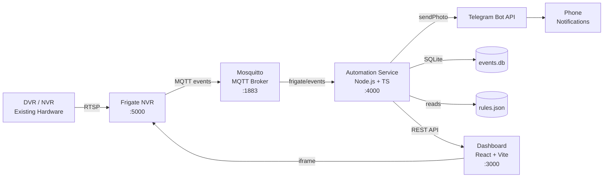
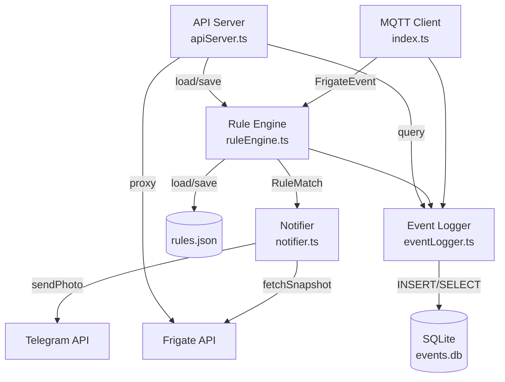
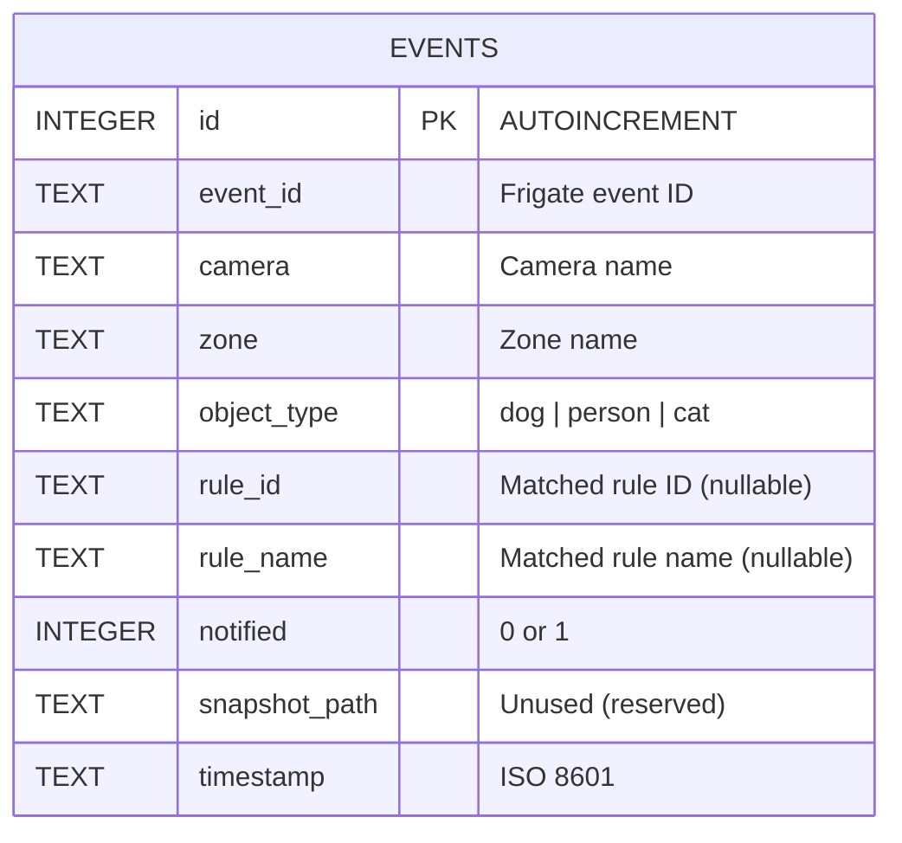

# Architecture — Tyson & Zoe Monitor

> Living document. Updated on any structural, infra, or data model change.

---

## System Diagram



---

## Component Responsibilities

### 1. Frigate NVR (`ghcr.io/blakeblackshear/frigate:stable`)

| Aspect | Detail |
|---|---|
| Purpose | RTSP stream ingestion, YOLOv8n object detection, zone management |
| Input | RTSP streams from DVR/NVR cameras |
| Output | MQTT events on `frigate/events` topic, snapshot images via REST API |
| Config | `config/frigate.yml` — cameras, zones, detection params |
| Storage | `media/clips/` — snapshots and recordings |

### 2. Mosquitto MQTT Broker (`eclipse-mosquitto:2`)

| Aspect | Detail |
|---|---|
| Purpose | Message bus between Frigate and Automation service |
| Config | `config/mosquitto.conf` — local-only, no auth |
| Topics | `frigate/events` — all detection events |

### 3. Automation Service (`services/automation/`)

| Aspect | Detail |
|---|---|
| Purpose | Rule evaluation, notification dispatch, event logging, REST API |
| Runtime | Node.js + TypeScript |
| Input | MQTT events from Frigate, REST requests from Dashboard |
| Output | Telegram notifications, SQLite event log, REST API responses |

**Internal modules:**



| Module | File | Responsibility |
|---|---|---|
| Entry / MQTT | `src/index.ts` | MQTT connection, event dedup, orchestration |
| Rule Engine | `src/ruleEngine.ts` | Load rules, evaluate event→rule matches, time restriction, cooldown |
| Notifier | `src/notifier.ts` | Fetch snapshot (2.5s delay), send Telegram photo with caption |
| Event Logger | `src/eventLogger.ts` | SQLite schema init, insert events, query with filters |
| API Server | `src/apiServer.ts` | Express REST API (6 endpoints) for dashboard |
| Types | `src/types.ts` | Shared interfaces (Rule, FrigateEvent, EventLogEntry) |

### 4. Dashboard (`dashboard/`)

| Aspect | Detail |
|---|---|
| Purpose | Web UI for monitoring events, configuring rules, viewing live feeds |
| Runtime | React 19 + Vite + Tailwind CSS v4 |
| Pages | EventsLog (`/events`), RulesConfig (`/rules`), LiveFeed (`/live`), Settings (`/settings`) |
| API | Proxied via nginx (`/api/` → automation:4000) in Docker; direct in dev |

---

## Data Flow

### Detection → Notification Pipeline

```
1. DVR/NVR sends RTSP stream to Frigate
2. Frigate runs YOLOv8n inference at 5 FPS
3. Object detected in zone → Frigate publishes MQTT event to frigate/events
4. Automation service receives event via MQTT subscription
5. Event deduplication check (event_id + zones combo)
6. Rule engine evaluates event against all enabled rules:
   a. Match camera, object type, zone, action
   b. Check time restriction (overnight ranges supported)
   c. Check cooldown (default 60s per rule)
7. For each matching rule:
   a. Wait 2.5s for Frigate to write snapshot
   b. Fetch snapshot from Frigate REST API
   c. Send Telegram photo + caption via sendPhoto API
   d. Mark rule cooldown
   e. Log event to SQLite (notified = true)
8. Non-matching events logged with notified = false
```

### Dashboard → API Data Flow

```
Dashboard (React)  ──GET /api/events──▶  apiServer.ts  ──query──▶  SQLite
Dashboard (React)  ──GET /api/rules───▶  apiServer.ts  ──read───▶  rules.json
Dashboard (React)  ──POST /api/rules──▶  apiServer.ts  ──write──▶  rules.json
Dashboard (React)  ──GET /api/health──▶  apiServer.ts  ──check──▶  MQTT + Frigate
Dashboard (React)  ──iframe src──────▶  Frigate UI (:5000)
```

---

## Data Model

### SQLite — `events` Table



**Indexes:** `idx_events_timestamp` (DESC), `idx_events_camera`

### Rules — `config/rules.json`

```typescript
interface Rule {
  id: string;              // e.g. "rule-dog-garden"
  name: string;            // Human-readable name
  camera: string;          // Must match Frigate camera name
  zone: string;            // Must match Frigate zone name
  objectType: "dog" | "person" | "cat";
  action: "entered" | "exited";
  timeRestriction: {
    enabled: boolean;
    startHour: number;     // 0–23
    endHour: number;       // 0–23
  };
  notificationTemplate: string;  // Telegram message text
  enabled: boolean;
}
```

---

## Docker Network

All services run on a shared `cctv-net` bridge network.

| Container | Hostname | Ports (host:container) |
|---|---|---|
| cctv-mosquitto | mosquitto | 1883:1883 |
| cctv-frigate | frigate | 5000:5000, 8554:8554 |
| cctv-automation | automation | 4000:4000 |
| cctv-dashboard | dashboard | 3000:80 |

Inter-service communication uses container hostnames (e.g., `http://frigate:5000`, `mqtt://mosquitto:1883`).

---

## Key Design Decisions

| Decision | Rationale |
|---|---|
| SQLite over PostgreSQL | Single-machine deployment, no server overhead, WAL mode for concurrent reads |
| File-based rules (JSON) | Simple config, editable by API and by hand, no migration needed |
| 2.5s snapshot delay | Frigate takes ~2s to write snapshot post-detection; delay ensures image availability |
| CPU-only inference | No GPU on target laptop; YOLOv8n at 5 FPS is acceptable for test phase |
| Nginx proxy in dashboard | Avoids CORS issues; `/api/` routes proxied to automation service |
| Event deduplication | Frigate sends multiple updates per event; dedup by event_id + zones prevents duplicate processing |
| In-memory cooldown tracking | Resets on service restart (acceptable); avoids DB writes for every cooldown check |

---

*Last updated: 2026-03-31*
